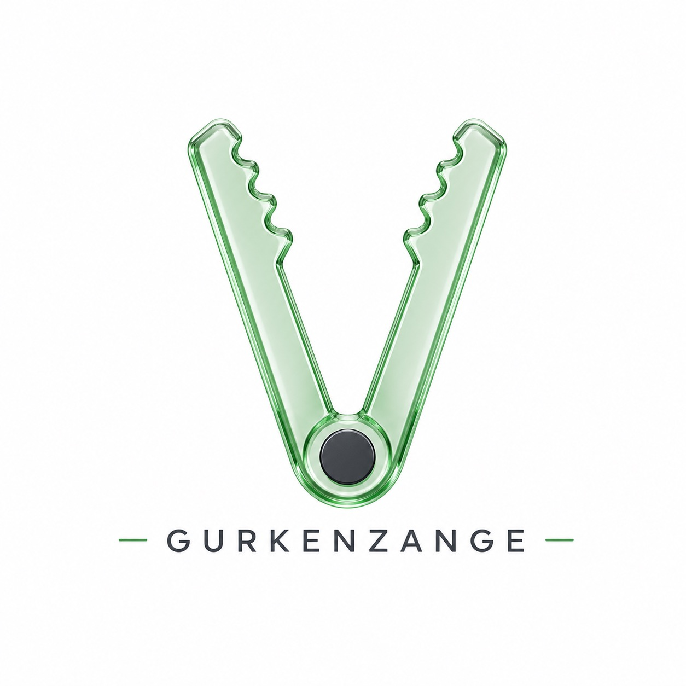

# Gurkenzange aus Acrylglas – Unterrichtsreihe Klasse 6


<p align="center">
  
</p>

Ein sofort nutzbares Unterrichtsprojekt für **Realschule/Gemeinschaftsschule Klasse 6** im Fach Technik. Die Reihe umfasst **6 Unterrichtseinheiten** zur Planung, Herstellung und Reflexion einer Gurken- bzw. Salatzange aus Acrylglas.

## Inhalte des Repos

- `unterrichtsreihe_gurkenzange.md` – vollständiger Unterrichtsplan mit 6 UE
- `index.html` – moderne Projektseite für GitHub Pages
- `logo.svg` – passendes Projektlogo
- `assets/page1.png` – Anleitungsseite 1
- `assets/page2_designhilfe.png` – Designhilfe Seite 2
- `assets/designhilfe_1.png` bis `assets/designhilfe_5.png` – einzelne Motivbilder aus der zweiten Seite

## Didaktische Leitidee

Die Schülerinnen und Schüler planen, sägen, schleifen und verformen einen Kunststoffstreifen zu einer funktionalen Küchenzange. Dabei verbinden sie technische Grundfertigkeiten mit Gestaltung, sicherem Arbeiten und der Reflexion von Herstellungsprozessen.

## Kompetenzen im Fokus

- Werkstoffeigenschaften von Acrylglas erkennen und beschreiben
- Werkzeuge sachgerecht und sicher einsetzen
- einfache technische Produkte planen und herstellen
- Gestaltungsideen entwickeln, vergleichen und begründet auswählen
- Arbeitsprozesse dokumentieren und Ergebnisse bewerten

## Einsatz im Unterricht

1. Einstieg über Alltagsproblem und Produktanalyse
2. Gestaltungsideen mit der Designhilfe entwickeln
3. Anreißen, Sägen und Nachbearbeiten
4. Thermisches Biegen unter Sicherheitsregeln
5. Funktionsprüfung und Optimierung
6. Präsentation, Reflexion und Bewertung

```

## Unterstützen

<a href="https://www.buymeacoffee.com/" target="_blank" rel="noopener noreferrer">
  
</a>
